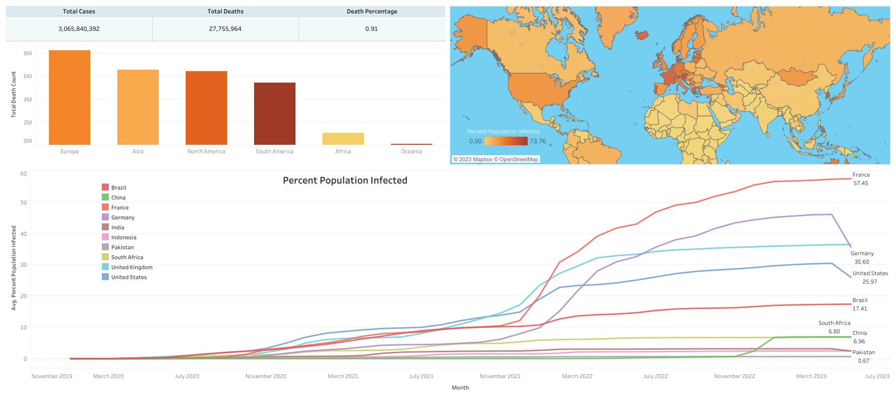

# COVID-19 Data Analysis and Visualisation


## Project Overview
This project analyses global COVID-19 data to uncover trends in infection rates, mortality rates, and vaccination progress across countries and continents.
The project combines SQL Server for data cleaning, transformation, and analysis with Tableau Public for interactive data visualisation. Microsoft Excel was used for initial data preparation and dataset organisation.

## Tableau Dashboard
The interactive dashboard visualises COVID-19 data collected between **01.01.2020** to **23.05.2023**.

### Dashboard Preview

🔗 Live Dashboard:
[View Interactive Tableau Dashboard](https://public.tableau.com/app/profile/chirag.arya4385/viz/Coviddata_17809148631170/Dashboard1?publish=yes) 

## Key Insights

- Identified countries with the highest infection rates relative to population.
- Compared mortality rates across continents and countries.
- Analysed global COVID-19 trends over time.
- Calculated rolling vaccination counts using SQL window functions.
- Visualised vaccination progress and death rates through Tableau dashboards.

## Tech Stack
- SQL Server Management Studio (SSMS)
- Tableau Public
- Microsoft Excel
- Git & GitHub

## Key Objectives
- Analyse COVID-19 infection rates worldwide
- Compare mortality rates across countries and continents
- Track vaccination progress and rolling vaccination counts
- Visualise insights through an interactive Tableau dashboard

## Data Processing
Data was processed using Microsoft Excel by:

- Dividing a large COVID-19 dataset into two separate datasets:
	- CovidDeaths
	- CovidVaccinations
- Preserving location and date fields to enable data integration and analysis.

## Data Cleaning
Data cleaning was performed using SQL Server.

## Date Standardisation
> To standardise date formats for analysis:

```SQL
ALTER TABLE CovidDeaths
ADD DateConverted Date

UPDATE CovidDeaths
SET DateConverted = CONVERT(DATE, date)
```

```SQL
ALTER TABLE CovidVaccinations
ADD DateConverted Date

UPDATE CovidVaccinations
SET DateConverted = CONVERT(DATE, date)
```

## Duplicate Detection
>Duplicate records were identified using CTEs and the ROW_NUMBER() function.

>Using the DELETE statement to remove the duplicate rows.

```SQL
WITH CTE AS 
(
	SELECT *, 
		ROW_NUMBER () OVER 
		(
			PARTITION BY location, DateConverted
			ORDER BY location, DateConverted
		) AS row_num
	FROM CovidDeaths
)
SELECT *
FROM CTE
WHERE row_num > 1
```

The same process was applied to the vaccination dataset.

```SQL
WITH CTE AS 
(
	SELECT *, 
		ROW_NUMBER () OVER 
		(
			PARTITION BY location, DateConverted
			ORDER BY location, DateConverted
		) AS row_num
	FROM CovidVaccinations
)
SELECT *
FROM CTE
WHERE row_num > 1
```
In this statement:\
First, the CTE uses the ROW_NUMBER() function to find the duplicate rows specified by values in the location and date columns.\
Then, the DELETE statement deletes all the duplicate rows but keeps only one occurrence of each duplicate group.

## Dropping Unused Columns

>Several unused columns were removed to improve query performance and reduce storage requirements. 

```SQL
ALTER TABLE CovidDeaths
DROP COLUMN date, total_cases_per_million, new_cases_per_million,  new_cases_smoothed_per_million,total_deaths_per_million,
 new_deaths_per_million,new_deaths_smoothed_per_million,
 reproduction_rate,icu_patients,icu_patients_per_million,
 hosp_patients,hosp_patients_per_million,weekly_icu_admissions,
 weekly_icu_admissions_per_million,weekly_hosp_admissions,
 weekly_hosp_admissions_per_million
 ```

 ```SQL
 ALTER TABLE CovidVaccinations
DROP COLUMN date, handwashing_facilities, hospital_beds_per_thousand,
	life_expectancy,human_development_index, excess_mortality_cumulative_absolute, excess_mortality_cumulative,excess_mortality,
	excess_mortality_cumulative_per_million,total_boosters,new_vaccinations,
	new_vaccinations_smoothed, total_vaccinations_per_hundred,people_vaccinated_per_hundred,
	people_fully_vaccinated_per_hundred,total_boosters_per_hundred,new_vaccinations_smoothed_per_million,
	new_people_vaccinated_smoothed,new_people_vaccinated_smoothed_per_hundred,stringency_index,
	population_density,median_age,aged_65_older,aged_70_older```
```

## Analysis Approach
The project focuses on answering the following business questions:

## Country-Level Analysis
- Infection Rate (Cases Percentage)
- Death Rate (Death Percentage)
- Highest Infection Rate
- Highest Death Rate
## Continent-Level Analysis
- Highest Infection Rate
- Highest Death Percentage
## Global Analysis
- Global Death Rate Over Time
## Vaccination Analysis
- Vaccination Count
- Rolling Vaccination Count
- Percentage of Population Vaccinated

## Key SQL Techniques Used

- Common Table Expressions (CTEs)
- Window Functions
- Aggregate Functions
- Joins
- Data Cleaning and Transformation
- Percentage Calculations
- Running Totals
- Date Conversion

Let’s load data into SQL and check the two tables to make sure it imported well.

> To see all columns of our datasets
```SQL
SELECT *
FROM CovidDeaths
ORDER BY location, DateConverted
```
```SQL
SELECT *
FROM CovidVaccinations
ORDER BY location, DateConverted
```

### 1.1 Country

#### 1.1.1 Infection Rate (Cases Percentage)
> To look at the total cases
```SQL
SELECT Location, DateConverted, total_cases, (total_cases/population) * 100 As CasesPercentage
FROM CovidDeaths
ORDER BY location, DateConverted
```
> Creating Cases Percentage column
```SQL
ALTER TABLE CovidDeaths 
ADD CasesPercentage FLOAT 

UPDATE CovidDeaths
SET CasesPercentage = (total_cases/population) * 100
```

#### 1.1.2 Death Rate (Death Percentage)

> To look at the total cases and total deaths
```SQL
SELECT Location, DateConverted, total_cases, total_deaths, (total_deaths/total_cases)*100 As DeathPercentage
FROM CovidDeaths
ORDER BY location, DateConverted
```
> Creating the Death Percentage column
```SQL
ALTER TABLE CovidDeaths 
ADD DeathPercentage FLOAT 

UPDATE CovidDeaths
SET DeathPercentage = (total_deaths/total_cases) * 100
```

#### 1.1.3 Highest Infection Rate

> To look at the country with the highest infection or case count
```SQL
SELECT location, Population, MAX(total_cases) AS HighestInfectionCount
FROM CovidDeaths
WHERE continent IS NOT NULL
GROUP BY location, Population
ORDER BY HighestInfectionCount DESC
```

> To look at the country with the highest infection rate compared to its population
```SQL
SELECT location, Population, MAX( total_cases) AS HighestInfectionCount, 
ROUND(MAX(total_cases/population) * 100 , 2) AS PercentagePopulationCases
FROM CovidDeaths
WHERE continent IS NOT NULL
GROUP BY location, Population
ORDER BY PercentagePopulationCases DESC
```

> Creating Percentage Population Cases column
```SQL
ALTER TABLE CovidDeaths 
ADD PercentagePopulationCases FLOAT

UPDATE CovidDeaths 
SET PercentagePopulationCases = (total_cases/ population)*100
WHERE continent IS NOT NULL
```

#### 1.1.4 Highest Death Percentage
> To look at the country with the highest death count
```SQL
SELECT location,Population, MAX(total_deaths) AS HighestDeathCount
FROM CovidDeaths
WHERE continent IS NOT NULL
GROUP BY location, Population
ORDER BY HighestDeathCount DESC
```

> To look at the country with the highest death rate compared to its population
```SQL
SELECT location, Population, MAX( total_deaths) AS HighestDeathCount, 
ROUND(MAX(total_deaths/population) * 100, 2) AS PercentagePopulationDeath
FROM CovidDeaths
WHERE continent IS NOT NULL
GROUP BY location, Population
ORDER BY PercentagePopulationDeath DESC
```

> Creating Percentage Population Death column
```SQL
ALTER TABLE CovidDeaths 
ADD PercentagePopulationDeath FLOAT

UPDATE CovidDeaths
SET PercentagePopulationDeath = (total_deaths/population) * 100
WHERE continent IS NOT NULL
```

### 1.2 Continent

#### 1.2.1 Highest Infection Rate

> To look at the continent with the highest case count and percentage
```SQL
SELECT continent, ROUND(MAX(total_cases/population) * 100, 2) AS ContinentCasesPercentage
FROM CovidDeaths
WHERE continent IS NOT NULL
GROUP BY continent
ORDER BY ContinentCasesPercentage DESC 
```

> Creating Continent Cases Percentage column
```SQL
ALTER TABLE CovidDeaths 
ADD ContinentCasesPercentage FLOAT

UPDATE CovidDeaths
SET ContinentCasesPercentage = (total_cases/population) * 100
WHERE continent IS NOT NULL
```

#### 1.2.2 Highest Death Percentage

> To look at the continent with the highest death count and percentage
```SQL
SELECT continent, MAX(total_deaths) AS HighestDeathCount, 
ROUND(MAX(total_deaths/population) * 100, 2) AS ContinentDeathPercentage
FROM CovidDeaths
WHERE continent IS NOT NULL
GROUP BY continent
ORDER BY ContinentDeathPercentage DESC 
```

> Creating Continent Death Percentage column
```SQL
ALTER TABLE CovidDeaths 
ADD ContinentDeathPercentage FLOAT

UPDATE CovidDeaths
SET ContinentDeathPercentage = (total_deaths/population) * 100
WHERE continent IS NOT NULL
```

### 1.3 Global

### 1.3.1 Death Rate

> To look at the total cases and death rate globally according to date
```SQL
SELECT DateConverted, SUM(new_cases) AS TotalCases , SUM(new_deaths) AS TotalDeaths, 
SUM(new_deaths)/NULLIF (SUM (new_cases),0) * 100 AS DeathRateGlobally
FROM CovidDeaths
WHERE continent is not null
GROUP BY DateConverted
ORDER BY 1
```

> Creating the Death Rate Globally column
```SQL
ALTER TABLE CovidDeaths 
ADD DeathRateGlobally FLOAT

UPDATE CovidDeaths
SET DeathRateGlobally = new_deaths/NULLIF ((new_cases),0) * 100
```

### 1.4 Vaccination

#### 1.4.1 Vaccination Count
- Total population that has been vaccinated
> To join both datasets
```SQL
SELECT *
FROM CovidDeaths AS dea
JOIN CovidVaccinations AS vac
ON dea.location = vac.location 
AND dea.DateConverted = vac.DateConverted
```

> To look at the total number of people vaccinated per day
```SQL
SELECT dea.continent, dea.location, dea.dateconverted, dea.population, vac.new_vaccinations
FROM coviddeaths dea
JOIN covidvaccinations vac
	ON dea.location = vac.location
	AND dea.dateconverted = vac.dateconverted
WHERE dea.continent IS NOT NULL
ORDER BY 2,3
```
#### 1.4.2 Rolling People Vaccination 

> To calculate the cumulative vaccinations by date
```SQL
SELECT dea.continent, dea.location, dea.dateconverted, dea.population, vac.new_vaccinations,
SUM(CAST(vac.new_vaccinations AS bigint)) 
OVER (PARTITION BY dea.location ORDER BY dea.location, dea.dateconverted) AS RollingPeopleVaccinated
FROM coviddeaths dea
JOIN covidvaccinations vac
	ON dea.location = vac.location
	AND dea.dateconverted = vac.dateconverted
WHERE dea.continent IS NOT NULL
ORDER BY 2,3
```

#### 1.4.2 Rolling People Vaccination Percentage
> To find the total vaccinated people compared to the population by using CTE
```SQL
WITH PopvsVac (continent, location, DateConverted, population, new_vaccinations, RollingPeopleVaccinated) 
AS 
(
SELECT dea.continent, dea.location, dea.dateconverted, dea.population, vac.new_vaccinations,
SUM(CAST(vac.new_vaccinations AS bigint)) 
OVER (PARTITION BY dea.location ORDER BY dea.location, dea.dateconverted) AS RollingPeopleVaccinated
FROM coviddeaths dea
JOIN covidvaccinations vac
	ON dea.location = vac.location
	AND dea.dateconverted = vac.dateconverted
WHERE dea.continent IS NOT NULL 
)
SELECT *,
       (RollingPeopleVaccinated/population)*100 AS PercentageRollingPeopleVaccinated
FROM PopvsVac
```
## Project Outcome
This project demonstrates practical experience in:

- SQL data cleaning and transformation
- Data exploration and business analysis
- Window functions and CTEs
- Tableau dashboard development
- Data storytelling and visualization

The project highlights an end-to-end analytics workflow, from raw data preparation to interactive business intelligence reporting.

## Datasets Used
The datasets used:

- Cover the period from **01 January 2020** to **23 May 2023**
- Include worldwide COVID-19 statistics
- Contain information on cases, deaths, vaccinations, and population

Source:

https://ourworldindata.org/covid-deaths

Project file:

[1. Covid Deaths.xlsx](Data_files/CovidDeaths.xlsx)

[2. Covid Vaccination.xlsx](Data_files/CovidVaccinations.xlsx)

## Built with
- SQL Server Management Studio
- Tableau Public
- Microsoft Excel

## Author

Chirag Arya

GitHub: https://github.com/AryaChirag

## Repository Structure
├── Data_files/
│ ├── CovidDeaths.xlsx
│ └── CovidVaccinations.xlsx
├── Media/
│ └── Dashboard.png
├── SQL/
│ └── Covid_Analysis.sql
└── README.md
